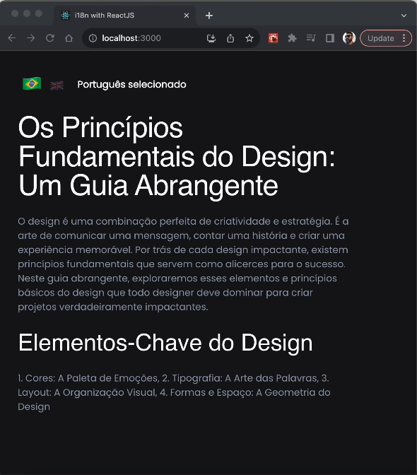

# Internacionalizando Reactjs com i18n


 

## Install pacotes react-i18next i18next
```shell
npm install react-i18next i18next 
 ```

## Criar pasta e arquivos relacionados
. Criar pasta ```i18n``` e arquivos ``` pt.json```  e ``` en.json``` 

### Estrutura
<pre>
├── node_modules/
├── public/
└── src
    └── i18n
        ├── i18n.jsx
        ├── pt.json
        ├── en.json
    ├── App.css
    ├── App.js
    ├── index.css
    ├── index.js
├── .gitignore
├── package.json
├── package-lock.json
├── README.md
</pre>


```jsx
// src/i18n/i18next.jsx

import i18next from "i18next";
import { initReactI18next } from "react-i18next";
import en from './en.json'
import pt from './pt.json'

i18next
    .use(initReactI18next)
    .init({
        compatibilityJSON: "v4",
        lng: 'en', // if you're using a language detector, do not define the lang option
        fallbackLng: 'en',
        resources: {
            en,
            pt
        },
        react: {
            useSuspense: false
        },
        interpolation: {
            escapeValue: false
        }
    })
export default i18next
```

```json
// src/i18n/pt.json

{
    "translation": {
        "language":"Português selecionado",
        "task_create_one": "Tarefa criada",
        "task_create_other": "{{count}} tarefas criadas",
        "post_title": "Os Princípios Fundamentais do Design: Um Guia Abrangente",
        "post_description": "O design é uma combinação perfeita de criatividade e estratégia. É a arte de comunicar uma mensagem, contar uma história e criar uma experiência memorável. Por trás de cada design impactante, existem princípios fundamentais que servem como alicerces para o sucesso. Neste guia abrangente, exploraremos esses elementos e princípios básicos do design que todo designer deve dominar para criar projetos verdadeiramente impactantes.",
        "keys_title": "Elementos-Chave do Design",
        "keys_names": "1. Cores: A Paleta de Emoções, 2. Tipografia: A Arte das Palavras, 3. Layout: A Organização Visual, 4. Formas e Espaço: A Geometria do Design"
     }
}
```

```json
// src/i18n/en.json

{
    "translation": {
        "language":"English selected",
        "task_create_one": "Task created",
        "task_create_other": "{{count}} tasks created",
        "post_title": "The Fundamental Principles of Design: A Comprehensive Guide",
        "post_description": "Design is a perfect blend of creativity and strategy. It is the art of communicating a message, telling a story, and creating a memorable experience. Behind every impactful design, there are fundamental principles that serve as foundations for success. In this comprehensive guide, we will explore these basic elements and principles of design that every designer must master to create truly impactful projects. ",
        "keys_title": "Key Design Elements",
        "keys_names": "1. Color: The Palette of Emotions, 2. Typography: The Art of Words, 3. Layout: Visual Organization, 4. Shapes and Space: The Geometry of Design"
    }
}
```

## Implementando na aplicação
- Importar arquivo i18n.jsx en.json e pt.json
- Importar e chamar hook useTranslation
- Implementar usando {t('YOUR_TRANSLATION_STRING')}

```jsx
// App.jsx

import './i18n/i18n.jsx'
import { useTranslation } from 'react-i18next';
import './App.css';

function App() {
  const { t, i18n } = useTranslation()
  return (
    <div>
      <h1>{t('language')}</h1>
    </div>
  );
}

export default App;

```


## Melhoria no estilo
```css
/* App.css */

:root {
  --background: #16161a;
  --button: #7f5af0;
  --headline: #fffffe;
  --button-text: #fffffe;
  --paragraph: #94a1b2;
}

@import url('https://fonts.googleapis.com/css?family=Poppins:400');

html {
  font-size: 100%;
} 

body {
  background-color: var(--background);
  box-sizing: border-box;
  font-weight: 400;
  font-family: 'Poppins', sans-serif;
  line-height: 1.75;
}

article {
  width: 36rem;
  max-width: 80%;
  padding: 2rem;
}

header {
  display: flex;
  align-items: center;
  justify-content: start;

}

header strong {
  font-size: 1rem;
  margin-left: 1rem;
  color: var(--button-text);
}

nav button {
  background-color: transparent;
  font-size: 1.6rem;
  opacity: 0.3;
  transition: all 0.2s linear;
}

nav button.button-active {
  opacity: 1;
  font-size: 2.2rem;
}

button {
  background-color: var(--button);
  color: var(--button-text);
  border: transparent;
}

h1 {
  color: var(--headline);
  font-size: 3.052rem;
  line-height: 1;
}

h2 {
  color: var(--headline);
  font-size: 2.441rem;
}

h3 {
  color: var(--headline);
  font-size: 1.953rem;
}

p {
  color: var(--paragraph);
  font-size: 1rem;
  margin-bottom: 1rem;
}
```

## Melhoria 

```jsx
import './i18n/i18n.jsx'
import { useTranslation } from 'react-i18next';
import './App.css';
import { useState } from 'react';

function App() {
  const { t, i18n } = useTranslation()
  const [currentLang, setCurrentLang] = useState('pt')

  const changeLang = (value) => {
    i18n
      .changeLanguage(value)
      .then(() => {
        setCurrentLang(value)
      })
      .catch((err) => {
        console.log(err)
      })

  }
  return (
    <article>
      <header>
        <nav>
          <button className={currentLang === 'pt' ? 'button-active' : 'button'} onClick={() => changeLang('pt')}>🇧🇷 </button>
          <button className={currentLang === 'en' ? 'button-active' : 'button'} onClick={() => changeLang('en')}>🇬🇧</button>
        </nav>
        <strong>{t('language')}</strong>
      </header>

      <main>
        <section>
          <h1>{t('post_title')}</h1>
          <p>{t('post_description')}</p>
          <h2>{t('keys_title')}</h2>
          <p>{t('keys_names')}</p>
        </section>
      </main>
    </article >
  );
}

export default App;
```